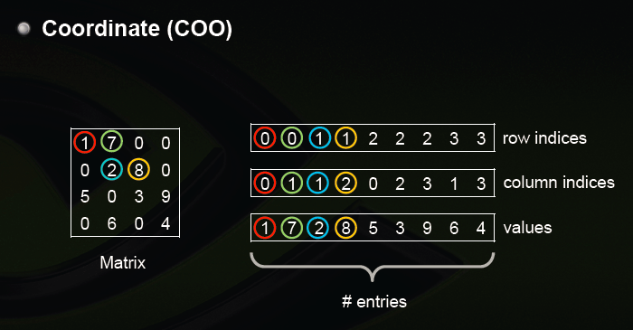
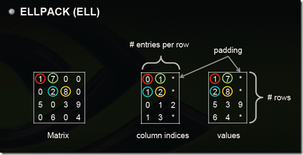
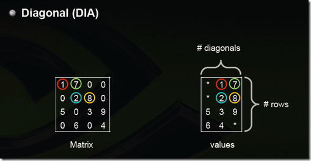
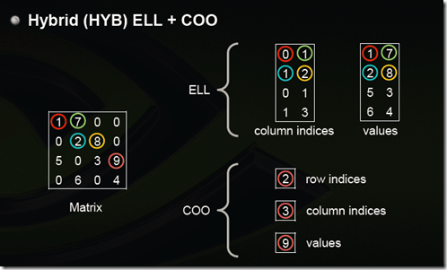

# 稀疏矩阵的压缩存储

> 本文转载自[稀疏矩阵存储格式总结 + 存储效率对比](http://www.cnblogs.com/xbinworld/p/4273506.html)

## 通常矩阵的压缩存储方式有如下几种

* [COO](#COO)
* [CSR](#CSR)
* [CSC](#CSC)
* [ELL](#ELL)
* [DIA](#DIA)
* [Hybird(HYB) ELL + COO](#HYB)

    ---

<h3 id="COO">COO </h3>

* 最简单的形式，每个元素用一个三元组表示，分别是(行号，列号，数值)，一个元素的三元组对应下图中的一列，这种方式简单，但是记录的重复信息较多，每个三元组可以自己定位，因此空间压缩不是最优

<h3 id="CSR">CSR</h3>

* CSR是比较标准的一种存储算法，也需要三类数据来表达一个有效元素：数值，列号，行偏移．CSR不是三元组，而是整体的编码方式，数值和列号与COO中表达方式一致，表示一个元素及其列号，行偏移数组表示某一行的第一个元素在values数组中的起始偏移位置，比如在下图中，第一行元素1是0偏移，第二行元素2在values中的偏移是２．

<h3 id="CSC">CSC</h3>

* CSC存储与CSR存储方式相对，相同方式存储列偏移位置

<h3 id="ELL">ELLPACK(ELL)</h3>

* 用两个和原始矩阵相同函数行数的矩阵来存储：第一个矩阵存储的是列号，第二个矩阵存储的是数值，行号用矩阵本身的行号表示．

* 这两个矩阵每行都是从头部开始存储，如果没有了元素就用标识符比如 **＊**　表示结束

　*下图中中间矩阵有误，第三行的值应为　０　２　３ ==*

* 如果某一行元素较其他元素特别多，那么这个矩阵就会很胖，其他行的后面的　**＊** 号会很多造成浪费．一种解决方式是存成数组，但是这样取某一行是就做不到随机存取

<h3 id="DIA">Diagonal(DIA)</h3>

* 对角线存储法，按对角线方式存储．这里列代表对角线序号，行代表行号．省略全零的对角线．(对角线序号从左下到右上依次标号，方向平行与主对角线)．
* 下图中第一条对角线全零省略，第二条对角线为 (5, 6), 第三条对角线全零省略，第四条对角线为(1, 2, 3, 4)，第五条对角线为(7, 8, 9)，第六条和第七条全零省略

* 这里行对应行，所以 5, 6 在第三第四行，前面补上无效元素 **＊**．如果对角线中间有 0 ，那么 0 不能省略，如果原始矩阵对角性很好，那么压缩效率很好，如果矩阵中元素的分布很随机，那么效率会非常差

<h3 id="HYB">Hybird (HYB) ELL + COO </h3>

* 为了解决 ELL 中的问题，当某一行的元素数量明显多余其他行时，将多出来的元素用 **COO** 方式单独存储．

## 选择稀疏矩阵存储方式的一些注意事项

+ DIA 和 ELL 格式在进行稀疏矩阵 - 矢量乘积(sparse matrix - vector products) 时效率最高，所以他们是应用迭代法(比如共轭梯度法)解稀疏线性系统最快的格式
+ COO 和 CSR 格式比起 DIA 和 ELL 来，更灵活，更易于操作
+ ELL 特点是快速，COO 的特点是灵活
+ 根据[Nahtan Bell](http://www.bu.edu/pasi/files/2011/01/NathanBell1-10-1000.pdf)的工作．，CSR 在存储矩阵时非零元素平均使用的字节数(Bytes for NonZero Entry)最为稳定(float 为9.5，double 类型为12.5)，而 DIA 格式存储数据的非零元素平均使用的字节数与矩阵类型有较大的关系，适合于 SturcturedMesh 结构的稀疏矩阵(float约为 4.5，double 约为 8.10)，对于 UnstructuredMesh 和 Random Matrix，DIA格式使用的字节数约为 CSR 的十几倍
+ 常用的线性代数计算库中，COO格式常用于从文件中进行稀疏矩阵的读写，而 CSR 格式常用于将读入数据后进行稀疏矩阵的计算

## 一些特殊类型矩阵的存储效率

* 数字越小压缩效率越高

#### Structured Mesh

   

#### Unstructured Mesh

#### Random Matrix

#### Power-Law Graph

