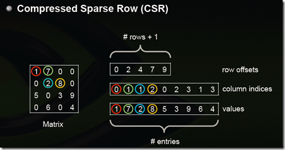
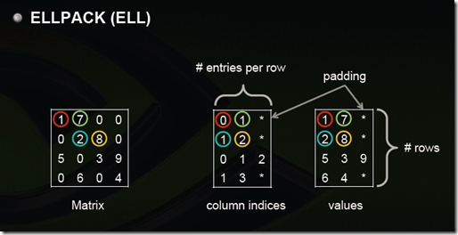
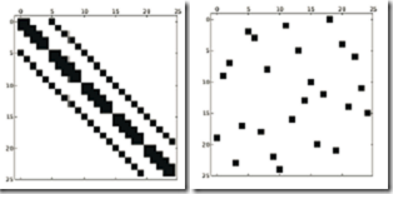
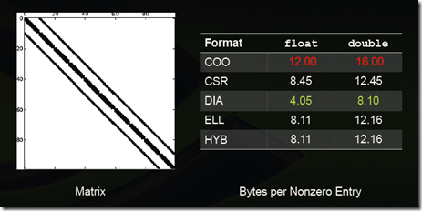

# 5月11日
* 1 对等模式下的MPI的不同的进程功能，地位和分工大致相似，代码也应该是相似的，所不同的只是操作的对象和数据，比如多个进程同时计算一个数组的不同部分和，各进程就是对等的
* 2 MPI（消息传递接口）适用于分布式内存编程，pthreads和openmp适用于共享内存编程，分布式内存中存在（核--内存）对，不同对之间的核内存访问有显著的延迟，共享内存编程各个核之间共享同一内存
* 3 GPU的并行计算模式使用SIMD，需要许多处理大量的数据来维持ALU的忙碌，可能在小问题上的性能较差，而且需要CPU的资源调度。
* 4 在同一时刻只能有一个线程执行的代码块称为临界区，如果有多个线程执行会产生不正确结果，比如对同一个全局变量的写操作就是有竞争条件的，不可以同时访问。
# 5月12日
* 1 MPI中通过MPI_Send和MPI_Recv实现进程间的通信，但实现的是点对点通信，多个集合之间的通信可以通过MPI_Reduce实现集合通信
* 2 MPI_Recv中有一个潜在陷阱，如果调用了一个MPI_Recv函数却没有一个匹配的MPI_Send函数调用发送信息，那么这个进程会永远阻塞，即进程悬挂
* 3 阿姆达尔定律指出一个并行程序的加速比的上限是其串行部分的比例
* 4 MPI_Send的原型是
```c++
    void MPI_Send(void* msg_buf_p, int msg_size, MPI_DATAtype msg_type, int dest, int tag, MPI_Comm communicator);

   // msg_buf_p包含指向包含消息内容的内存块的指针

   // msg_size 和msg_type指明了消息的大小和类型即数据量

   // dest 指明了接受消息的进程号， tag用于区分看上去完全一样的信息

   // communicator 通信子，所有设计通信的MPI函数都有通信子参数，目的之一是指定通信范围
```
* 5 通信子指的是一组可以互相发消息的进程的集合，一个通信子中的进程所发送的信息不能被另一个通信子中的进程所接受
# 5月13日
* 1 MPI_Recv的原型是

```c++
 void MPI_Recv(void* msg_buf_p, int buf_size, MPI_Datatype buf_type, int source, int tag, MPI_Comm communicator, MPI_Status* status)`

 //前三个参数指定了用于接受信息的内存

 //tag要与发送消息的参数tag相匹配， communicator必须与发送进程的通信子相匹配

 //status用来确定发送者和标签， 至少包含三个成员： MPI_SOURCE, MPI_TAG, MPI_ERROR

```

* 2 MPI要求消息是不可超越的，即同一进程发送给另外一条进程两条消息，那么第一条消息必须在第二条消息前可用，但对不同进程间通信无要求
# 5月14日
* 1 MPI_Init和MPI_Finalize函数是为了告知MPI系统进行所有必要的初始化设置。在MPI_Init调用前，不应该调用任何MPI函数，在MPI_Finalize调用后不应该调用任何MPI函数

* 2 MPI_Init的原型是
```c++
    int MPI_Init(int* argc_p, char *** argv_p);

    //argc_p和argv_p是指向命令汗参数的指针，当不需要是可以直接设置为NULL，返回值是int型的错误码

    void MPI_Finalize(void)//用来结束MPI

```
# pthread 初探
## 5月19日
* 1 pthread用于共享内存编程，所创建的最小运行实例是线程，与MPI不同，MPI的创建的是可互相通信的进程
* 2 进程是正在运行或挂起的程序的一个实例，除了可执行代码外，它还包括：
    * 栈段
    * 堆段
    * 系统为进程分配的资源描述符，如文件描述符等
    * 安全信息，如进程允许访问的硬件和软件资源
    * 描述进程状态的信息，如进程是否准备运行或这正在等待某个资源，寄存器中的内容等
* 3 线程来自于"控制线程"的概念控制线程是程序中的一个语句序列，建议在单个进程中使用术语控制流，在共享内存的程序中，一个进程中可以有多个线程
* 4 由pthread创建的每个线程都内含一个pthread_t对象，pthread_t对象是一个不透明对象，对象中存储的数据是由系统绑定的，用户级代码无法直接访问，可以通过检查pthread_t对象来区分同线程
* 5 创建线程需要调用pthread_create函数，其函数原型为

```c++
    int pthread_create (pthread_t* thread_p, const pthread_attr_t* attr_p,
                        void* (*start_routine)(void *), void * arg_p );

    //thread_p是个指向对应pthread_t对象的指针，但其内存空间必须在调用该函数前开辟

    //第三个参数是这个线程要运行的函数，最后一个指针也是参数，指向start_routine的参数

```
# 5月26日
* 1 最简单的实现各个线程不同时执行临界区的方法是设置全局的标志量，主线程将其初始化为0,在各个线程中执行 
    即可实现忙等待，每个线程负责对标志量更新，这里，执行顺序是确定的  
  ` while(flag not_eq my_rank);` 

* 2 忙等待的好处是可带来明确的线程运行顺序，但是在线程数多于核数的情况下会严重降低程序的运行效率， 因为
    在忙等待时仍占用cpu资源

* 3 互斥量可以让线程等待时挂起，不再占用cpu资源，这里有两个互斥量函数，调用pthread_mutex_lock会使线程等待直到没有其他线程进入临界区
    调用pthread_mutex_lock会通知系统线程已经完成临界区中代码的执行，两函数调用之间的即为临界区

`int pthread_mutex_lock(pthread_mutex_t* mutex_p)`

`int pthread_mutex_unlock(pthread_mutex_t* mutex_p)`# 6月11日
## openMP

* 1 `#pragma omp parallel for num_threads(thread_count)`

上面这条语句将for循环并行化，默认模式是按块划分，每个线程按序获得 n / thread_count 个迭代次数

* 2 1中的并行化指令并不检查循环间的数据依赖，如果有数据依赖，结果将出错，可以通过一些方法消除循环间的数据依赖，
例如将一个迭代过程转化为公式计算

* 3 将相同的归约操作符重复的应用到操作数序列来得到一个结果的计算称为归约操作，归约操作的并行化对结果变量是有竞争的，可以通过下面这条指令显式指明归约操作

`#pragma omp parallel for num_threads(thread_count) reduction( : )`

`reduction( <operator> : <variable list> )`指令前面填写归约操作符，后面填写归约变量

* 4 `#pragma omp parallel for num_threads(thread_count)`并行化for循环，但是只能是典型结构的for循环并行化

   1. for(;;) 无限循环
   2. 结构块中出现 `if(....) break`语句， 这样给for循环添加了一个出口
   3. 循环变量index必须是整型或指针类型
   4. start, end和incr不能在循环过程中改变
   5. 循环变量只能在for结构语句中的增量表达式中修改# PAC习题笔记

## 做了下题，涉及到的东西没机会接触啊，还是记下来吧

* 1 在神威太湖之光系统的服务节点上启动调试的命令是swgdb
* 2 SW２６０１０处理器主核支持C++01和Fortran2003
* 3 编译时编译选项中链接libnetcdf.a库的正确用法是　　`-Inetcdf`
* 4 在提交作业时，可以使用sw3run处理器，同时使用特定的选项制定程序内存的类型，其中交叉段通过-T指定
* 5 源码文件使用Fortran语言，采用MPI + Athread模式编译主核代码的正确命令是　` sw5f90 -host [选项]　filename`
* 6 神威太湖之光上申威２６０１０处理器实际支持的内存容量是32GB
* 7 神威太湖之光系统整机由４０９６０个SW26010处理器组成
* 8 基于SW26010处理器体系结构特点，用户可以采用以下并行模式实现众核高校并行
    1. 主从加速并行
    2. 主从协同并行
    3. 主从异步并行
    4. 主从动态并行

* 9 Intel 调优助手能够给我们自动推荐优化代码的方案，主要是从一下几方面
    1. 处理器瓶颈及改进
    2. 取样向导增强
    3. 超线程

* 10 神威太湖之光支持的向量数据类型有
    1. 32位字向量
    2. 单精度浮点向量
    3. 双精度浮点向量
* 11 对于解决串行方面的难题，有一下几种思路
    1. 少用锁，甚至采用无锁编程
    2. 使用原子操作替代锁
    3. 从设计和算法层面来缩小串行化所占的比例
* 12 用户可以用ldmreport命令查看从核程序局存的使用情况，具体包括
    1. 所有局存私有变量的名称，地址和大小
    2. LDM变量总的对界属性
    3. 可重用局存私有变量的名称，地址和大小
    4. LDM变量的总大小
* 13 当用户程序加速性能不理想是，可以从一下几方面的优化
    1. 对从核程序实现计算和通信的相互隐藏
    2. 减少从核访存的次数
    3. 从核尽量使用连续访存替代离散访存
    4. 尽可能使用已有的函数库
* 14 神威太湖之光的MPI环境支持以下标准
    1. MPI1.0
    2. MPI2.0
    3. MPI3.0
* 15 加速线程库分别对主核，从核程序提供相应的接口，以下是主核加速线程库
    1. athread_join
    2. athread_spawn
* 16 OpenACC编译器提供了以下等编译选项用来帮助用户对线程进行性能分析
    1. -ldmAnalyse
    2. -arrayAnalyse
    3. -priv
# ６月２４日
## 第二次做练习题，题目与之前的可能有重复

* 1 在基于MPI编程模型中，计算是由一个或多个彼此调用函数库进行消息收，发通信进程所组成
* 2 关于SIMD并行化，有以下几种描述
    1. 把数组对齐到cache行边界有利于获得好的SIMD性能
    2. 一般而言，结构体数组这种存储结构不于SIMD向量化，因为数据访问的步长一般不是１
* 3 神威太湖之光支持　MPI　＋　pthread　＋ athread三级并行方式
* 4 SWCC一个整型数组中数据传递到一个intv8类型变量的方法包括
    1. 使用内置赋值函数
    2. 使用内部访存函数
    3. 使用指针
* 5 串行优化中 `-O2` 是默认的编译选项，需要较长的编译时间，但也带来了更加突出的优化效果
* 6 申威26010处理器的运算核心可以使用数据块传输功能完成核心存储与主存之间的数据交换
* 7 用户程序运行时，一个MPI进程最多可以使用小于32GB的内存空间
* 8 主核编译选项优化中，数据预期选项 `-CG:pf_L1_ld:df_L1_st:pf_L2_ld=0:pf_L2_st=0`可以改变预取指令的类型，决定生成的预取指令是否是有限淘汰的
* 9 应用程序在实际运行时，当主进程内存需求超过8GB小于32GB的课题需要采用全片共享master模式
* 10 下面是英特MKL多线程的部分特性
    1. MKL是线程安全的，可以在多线程中被使用
    2. MKL是使用OpenMP实现多线程
    3. MKL函数内部实现了多线程
* 11 神威太湖之光系统上提供了高性能扩展数学库xMath，主要包括一下模块
    1. BLAS模块
    2. LAPACK1.5.0模块
    3. FFT模块
    4. 迭代解法器模块
* 12 神威太湖之光使用一下两种编程方式实现众核并行
    1. athread
    2. OpenACC
* 13 对于现代微处理器体系结构而言，对性能优化影响比较大的主要是
    1. 超标量
    2. 乱序执行
    3. 指令流水线的深度
* 14 SW26010支持以下SIMD操作
    1. 32 * 8的定点运算
    2. 256 * 1的定点运算
    3. 64 * 4的单精度浮点运算
    4. 64 * 4　的双精度浮点运算
* 15 在引入线程的操作系统中，进程之间可以并发执行
* 16 进程是拥有系统资源的一个独立单位，它可以拥有自己的资源
* 17 要充分发挥申威26010处理器的计算性能，程序员可以优化的有
    1. 数据的重用性
    2. 数据的局部性
    3. 计算和访存的重叠
    4. 计算和通信的重叠
* 18 神威太湖之光系统支持的作业运行状态包括
    1. PEND
    2. RUN
    3. DONE
    4. CKPT    # 6月25日
## 最后一次习题练习了

* 1 过程间分析，可以进行向量传播，inline等多项优化的选项是 `-IPA`
* 2 Lustre文件系统中用于存放元数据的服务器叫MDS
* 3 FORTRAN通过内存在标准数据类型与扩展类型的变量之间进行数据交换的方法与C相同
* 4 用户可以通过qload命令可以查看资源情况，包括下列信息
    1. 用户的节点资源队列
    2. 当前用户可使用的核组数
    3. 用户可使用的节点资源所在的机舱位置
* 5 用户可以在MPI程序的基础上通过添加OpenACC2.0的指示语句来实现主从加速，其中的编译只是data用于定义加速计算的数据区，其后可以添加一下功能子句
    1. if子句
    2. copy/copyin/copyout子句
    3. present子句
* 6 SW-OpenACC编译系统支持下列语言标准编写的程序
    1. C语言
    2. FORTRAN90语言
    3. FORTRAN95语言
* 7 申威26010处理器管理核心的功能有以下几种
    1. 运算功能
    2. 通信功能
    3. 内存管理功能
    4. 功耗控制功能
* 8 英特尔Parallel Composer主要包含
    1. Intelc/c++ 编译器
    2. IPP性能库
    3. TBB多线程开发库
# 6月9日
## openMP初探

* 1 openMP提供基于指令的共享内存API。在C和C++中主要通过编译预处理指令实现

`#pragma omp`

* 2 编译一个使用openMP示例(example.cpp)文件，需要的编译器选项

`g++ -g -Wall -fopenmp -o output_name example.cpp`

`// -g 产生调试信息     -Wall 显示所有警告`

‘// -fopenmp 启用openMP  -o 制定目标文件名称’

* 3 C和C++中编译预处理指令通过 
`#pragma` 实现，而openMP总是通过
`#pragma omp`开始

* 4 `#pragma omp`后面的第一条指令是一条parallel指令，用来表明之后的结构化代码块应该被多个线程并行执行
一个结构化代码块是一条C语句或者只有一个入口和出口的一组复合语句。

* 5 `#pragma omp parallel num_threads(thread_count)`

上面这条语句后面的`num_threads(thread_count)`指定了执行下面代码块的线程数为num_counts
# 8月9日

# PAC　习题

* Lustre 文件系统主要由三个部分组成：客户端，对象存储服务器 OST 和元数据服务器 MDS
* 高性能计算机系统的浮点效率计算公式
      持续性能　/ 峰值性能

* MPI 只是为程序员提供一个并行环境库，程序员通过调用 MPI 的库程序来达到程序员所要达到的并行目的，MPI提供C语言和Fortran语言的接口
* 消息传递是消息数据从一个处理器的内存拷贝值另一个处理器内存的方法
* MPI 通过指定通信因子和组来完成各个进程间的图哦你新，大多数 MPI 调用要求加入通信因子这个参数
* `sw5cc -slave [选项] 文件名` 是 C 语言从核代码的编译指令
* OpenACC 编译器提供了一系列编译选项用来帮助用户对进程进行性能分析，下列选项能够实现该功能
      1. -ldmAnalyse
      2. -arrayAnalyse
      3. -priv
* 下面是关于 OpenACC 编译器循环指示功能
      1. tile
      2. collapse

* 下面是关于 intel MKL 多线程的特性
      1. MKL 是线程安全的，可以在多线程中被使用
      2. MKL 使用 OpenMP 实现多线程
      3. MKL 函数内部实现来多线程

* 对于现代微处理器体系结构而言，对性能优化影响比较大的主要是
      1. 超标量
      2. 乱序执行
      3. 指令流水线的深度

* 用户程序加速性能不理想时，可以采用以下优化策略
      1. 对从核程序实现计算和通信的相互隐藏
      2. 减少从核访存的次数
      3. 从核程序尽量使用连续访存代替离散访存
      4. 尽可能使用已有的函数库

* 加速线程库分别对主核，从核程序提供相应的接口，下列接口中属于主核加速线程库
      1. athread_join
      2. athread_spawn

* 用户可以在 MPI 程序的基础上通过添加 OpenACC2.0 的指示语句来实现主从加速，其中指示 data 用于定义加速计算的数据区，其后可以添加以下功能子句
      1. if
      2. copy/ copyin/ copyout
      3. present

* 用户可以用 qload 命令可以查看资源情况，包含以下信息
      1. 用户的节点资源队列
      2. 当前用户可使用的核组数
      3. 用户可使用的节点资源所在的机舱位置

* 对访问方式不连续的数据的拷贝，会导致编译器生成带跨步的数据拷贝操作，性能相对较差，用户可以使用**数值转置子句**来标识这种数组

* 过程间分析，可以进行常量传播，inline等多项优化的选项是 `-IPA`

      
# parallel_computing_note
* 并行计算学习笔记
# 稀疏矩阵的压缩存储

> 本文转载自[稀疏矩阵存储格式总结 + 存储效率对比](http://www.cnblogs.com/xbinworld/p/4273506.html)

## 通常矩阵的压缩存储方式有如下几种

* [COO](#COO)
* [CSR](#CSR)
* [CSC](#CSC)
* [ELL](#ELL)
* [DIA](#DIA)
* [Hybird(HYB) ELL + COO](#HYB)

    ---

<h3 id="COO">COO </h3>

* 最简单的形式，每个元素用一个三元组表示，分别是(行号，列号，数值)，一个元素的三元组对应下图中的一列，这种方式简单，但是记录的重复信息较多，每个三元组可以自己定位，因此空间压缩不是最优


<h3 id="CSR">CSR</h3>

* CSR是比较标准的一种存储算法，也需要三类数据来表达一个有效元素：数值，列号，行偏移．CSR不是三元组，而是整体的编码方式，数值和列号与COO中表达方式一致，表示一个元素及其列号，行偏移数组表示某一行的第一个元素在values数组中的起始偏移位置，比如在下图中，第一行元素1是0偏移，第二行元素2在values中的偏移是２．



<h3 id="CSC">CSC</h3>

* CSC存储与CSR存储方式相对，相同方式存储列偏移位置

<h3 id="ELL">ELLPACK(ELL)</h3>

* 用两个和原始矩阵相同函数行数的矩阵来存储：第一个矩阵存储的是列号，第二个矩阵存储的是数值，行号用矩阵本身的行号表示．

* 这两个矩阵每行都是从头部开始存储，如果没有了元素就用标识符比如 **＊**　表示结束

　*下图中中间矩阵有误，第三行的值应为　０　２　３ *



* 如果某一行元素较其他元素特别多，那么这个矩阵就会很胖，其他行的后面的　**＊** 号会很多造成浪费．一种解决方式是存成数组，但是这样取某一行是就做不到随机存取

<h3 id="DIA">Diagonal(DIA)</h3>

* 对角线存储法，按对角线方式存储．这里列代表对角线序号，行代表行号．省略全零的对角线．(对角线序号从左下到右上依次标号，方向平行与主对角线)．
* 下图中第一条对角线全零省略，第二条对角线为 (5, 6), 第三条对角线全零省略，第四条对角线为(1, 2, 3, 4)，第五条对角线为(7, 8, 9)，第六条和第七条全零省略


* 这里行对应行，所以 5, 6 在第三第四行，前面补上无效元素 **＊**．如果对角线中间有 0 ，那么 0 不能省略，如果原始矩阵对角性很好，那么压缩效率很好，如果矩阵中元素的分布很随机，那么效率会非常差



<h3 id="HYB">Hybird (HYB) ELL + COO </h3>

* 为了解决 ELL 中的问题，当某一行的元素数量明显多余其他行时，将多出来的元素用 **COO** 方式单独存储．


## 选择稀疏矩阵存储方式的一些注意事项

+ DIA 和 ELL 格式在进行稀疏矩阵 - 矢量乘积(sparse matrix - vector products) 时效率最高，所以他们是应用迭代法(比如共轭梯度法)解稀疏线性系统最快的格式
+ COO 和 CSR 格式比起 DIA 和 ELL 来，更灵活，更易于操作
+ ELL 特点是快速，COO 的特点是灵活
+ 根据[Nahtan Bell](http://www.bu.edu/pasi/files/2011/01/NathanBell1-10-1000.pdf)的工作．，CSR 在存储矩阵时非零元素平均使用的字节数(Bytes for NonZero Entry)最为稳定(float 为9.5，double 类型为12.5)，而 DIA 格式存储数据的非零元素平均使用的字节数与矩阵类型有较大的关系，适合于 SturcturedMesh 结构的稀疏矩阵(float约为 4.5，double 约为 8.10)，对于 UnstructuredMesh 和 Random Matrix，DIA格式使用的字节数约为 CSR 的十几倍
+ 常用的线性代数计算库中，COO格式常用于从文件中进行稀疏矩阵的读写，而 CSR 格式常用于将读入数据后进行稀疏矩阵的计算

## 一些特殊类型矩阵的存储效率

* 数字越小压缩效率越高

#### Structured Mesh

   

#### Unstructured Mesh


#### Random Matrix


#### Power-Law Graph


